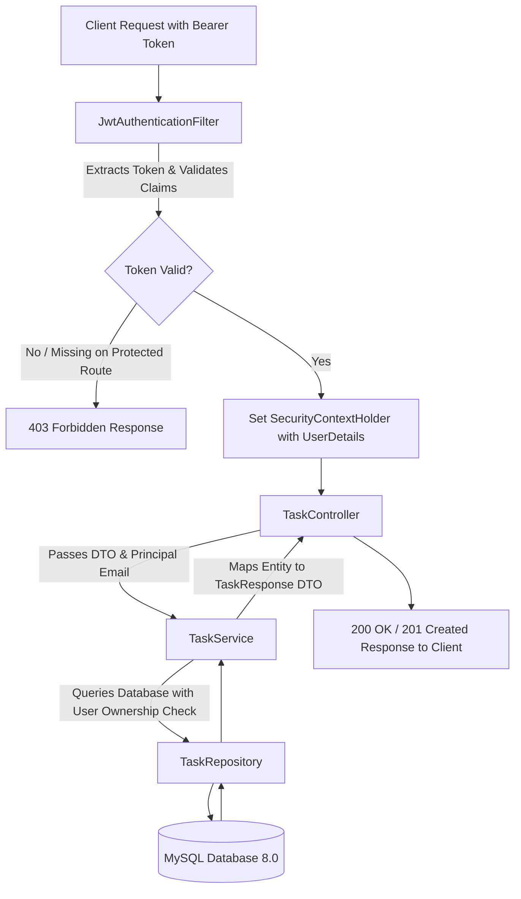

# 🏛️ Project Structure & Architecture Walkthrough

This document provides a comprehensive breakdown of the **Secure Task Management API** codebase. Use this guide to understand the system architecture, code organization, and how to explain this project in interviews or technical discussions.

---

## 🎯 1. Project Overview & Elevator Pitch

### 30-Second Elevator Pitch:
> *"I built a production-grade, secure RESTful Task Management API using **Java 17**, **Spring Boot 3**, **Spring Security 6**, and **MySQL** containerized in **Docker**. It implements **stateless JWT authentication** and **strict multi-tenant data isolation**, guaranteeing that users can only access and modify their own tasks, effectively preventing Insecure Direct Object Reference (IDOR) vulnerabilities."*

### Why this project was built:
* **Problem:** Many task management systems either store sessions in memory (limiting scalability) or fail to properly isolate user data, allowing one user to manipulate another user's records by guessing IDs.
* **Solution:** A clean, stateless architecture with JJWT token validation on every request and explicit ownership verification at the service layer before any database operation.

---

## 📂 2. Comprehensive Directory & Package Structure

```
Secure-task-management-api/
├── .mvn/wrapper/                  # Maven wrapper binaries
├── docker-compose.yml             # Docker configuration for MySQL 8.0 (Port 3307:3306)
├── mvnw / mvnw.cmd                # Maven wrapper execution scripts
├── pom.xml                        # Maven dependencies & build plugins
├── README.md                      # Primary project documentation & quickstart
├── docs/                          # Detailed architecture & concepts guides
│   ├── PROJECT_STRUCTURE_AND_WALKTHROUGH.md
│   └── SPRING_BOOT_SECURITY_CONCEPTS.md
└── src/
    └── main/
        ├── resources/
        │   └── application.properties  # Database, JPA, and JWT configurations
        └── java/com/example/taskmanager/
            ├── TaskManagerApplication.java   # Main Spring Boot entry point
            │
            ├── config/
            │   └── SecurityConfig.java       # Spring Security 6 FilterChain & beans
            │
            ├── security/
            │   ├── JwtService.java                 # Token generation, signing, claims extraction
            │   ├── JwtAuthenticationFilter.java     # Request interceptor (OncePerRequestFilter)
            │   └── CustomUserDetailsService.java   # Bridge between Spring Security & UserRepository
            │
            ├── controller/
            │   ├── AuthController.java       # Public endpoints: /api/auth/register, /api/auth/login
            │   └── TaskController.java       # Protected endpoints: /api/tasks/**
            │
            ├── service/
            │   ├── AuthService.java          # User registration & authentication logic
            │   └── TaskService.java          # Task CRUD logic & multi-tenant isolation checks
            │
            ├── repository/
            │   ├── UserRepository.java       # Spring Data JPA interface for 'users' table
            │   └── TaskRepository.java       # Spring Data JPA interface for 'tasks' table
            │
            ├── entity/
            │   ├── User.java                 # JPA Entity mapped to 'users' table (UserDetails)
            │   └── Task.java                 # JPA Entity mapped to 'tasks' table (@ManyToOne User)
            │
            ├── dto/
            │   ├── RegisterRequest.java      # Registration payload with Jakarta validation
            │   ├── LoginRequest.java         # Login credentials payload
            │   ├── LoginResponse.java        # Response containing JWT token and user info
            │   ├── TaskRequest.java          # Task creation/update payload
            │   ├── TaskResponse.java         # Sanitized task output DTO (no circular refs)
            │   └── ErrorResponse.java        # Standardized JSON error response format
            │
            ├── enums/
            │   ├── Role.java                 # User roles (USER, ADMIN)
            │   └── TaskStatus.java           # Task states (TODO, IN_PROGRESS, COMPLETED)
            │
            └── exception/
                ├── GlobalExceptionHandler.java      # @RestControllerAdvice for uniform errors
                ├── ResourceNotFoundException.java   # Thrown when entity ID is not found (404)
                ├── UnauthorizedAccessException.java # Thrown on cross-user data access (403)
                └── UserAlreadyExistsException.java  # Thrown when email is duplicate (409)
```

---

## 🔍 3. Detailed Component Breakdown

### 1️⃣ Configuration & Security Layer (`config/`, `security/`)
* **[SecurityConfig.java](file:///Users/rahulnegi/Desktop/Secure%20task%20mgmt%20api/src/main/java/com/example/taskmanager/config/SecurityConfig.java):**
  * Defines the `SecurityFilterChain` bean.
  * Disables CSRF (since JWT tokens are immune to CSRF in stateless setups).
  * Defines route permissions: `/api/auth/**` is public (`permitAll()`), all other routes require authentication (`authenticated()`).
  * Sets `SessionCreationPolicy.STATELESS` so no `HttpSession` is stored in RAM.
  * Registers `JwtAuthenticationFilter` before `UsernamePasswordAuthenticationFilter`.
* **[JwtService.java](file:///Users/rahulnegi/Desktop/Secure%20task%20mgmt%20api/src/main/java/com/example/taskmanager/security/JwtService.java):**
  * Uses **JJWT 0.12.x** with HMAC-SHA256 (`Keys.hmacShaKeyFor`).
  * Generates signed tokens with claims: `sub` (email), `role`, `iat` (issued at), and `exp` (24-hour expiration).
  * Validates signatures and expiration timestamps.
* **[JwtAuthenticationFilter.java](file:///Users/rahulnegi/Desktop/Secure%20task%20mgmt%20api/src/main/java/com/example/taskmanager/security/JwtAuthenticationFilter.java):**
  * Extends `OncePerRequestFilter` to intercept every incoming HTTP request.
  * Reads the `Authorization: Bearer <token>` header.
  * Validates the token and sets `UsernamePasswordAuthenticationToken` in `SecurityContextHolder`.

---

### 2️⃣ Web / Controller Layer (`controller/`, `dto/`)
* **[AuthController.java](file:///Users/rahulnegi/Desktop/Secure%20task%20mgmt%20api/src/main/java/com/example/taskmanager/controller/AuthController.java):**
  * Exposes `POST /api/auth/register` and `POST /api/auth/login`.
  * Uses `@Valid` to trigger automatic field validation on incoming DTOs.
* **[TaskController.java](file:///Users/rahulnegi/Desktop/Secure%20task%20mgmt%20api/src/main/java/com/example/taskmanager/controller/TaskController.java):**
  * Exposes CRUD endpoints: `POST /api/tasks`, `GET /api/tasks`, `GET /api/tasks/{id}`, `PUT /api/tasks/{id}`, `DELETE /api/tasks/{id}`.
  * Injects `Principal principal` (automatically populated by Spring Security) to identify the logged-in user securely.
* **DTOs (`dto/`):**
  * Prevent **Over-Posting Vulnerabilities** and avoid circular JSON serialization issues between `User` and `Task`.

---

### 3️⃣ Business & Service Layer (`service/`)
* **[AuthService.java](file:///Users/rahulnegi/Desktop/Secure%20task%20mgmt%20api/src/main/java/com/example/taskmanager/service/AuthService.java):**
  * Validates email uniqueness.
  * Encrypts plain-text passwords using `BCryptPasswordEncoder`.
  * Authenticates via Spring's `AuthenticationManager` and issues JWT tokens.
* **[TaskService.java](file:///Users/rahulnegi/Desktop/Secure%20task%20mgmt%20api/src/main/java/com/example/taskmanager/service/TaskService.java):**
  * **Ownership Isolation Enforcement:**
    ```java
    if (!task.getUser().getId().equals(user.getId())) {
        throw new UnauthorizedAccessException("You do not have permission to access this task");
    }
    ```
  * Ensures users only see their own tasks using `taskRepository.findByUserOrderByCreatedAtDesc(user)`.

---

### 4️⃣ Persistence & Data Layer (`entity/`, `repository/`)
* **[User.java](file:///Users/rahulnegi/Desktop/Secure%20task%20mgmt%20api/src/main/java/com/example/taskmanager/entity/User.java):**
  * Implements Spring Security's `UserDetails` interface.
  * Contains `id`, `name`, `email` (unique index), `password` (BCrypt hash), and `role`.
* **[Task.java](file:///Users/rahulnegi/Desktop/Secure%20task%20mgmt%20api/src/main/java/com/example/taskmanager/entity/Task.java):**
  * Contains `id`, `title`, `description`, `status` (Enum: `TODO`, `IN_PROGRESS`, `COMPLETED`), `createdAt`, `updatedAt`.
  * Linked to `User` via `@ManyToOne(fetch = FetchType.LAZY)`.
* **[TaskRepository.java](file:///Users/rahulnegi/Desktop/Secure%20task%20mgmt%20api/src/main/java/com/example/taskmanager/repository/TaskRepository.java):**
  * Spring Data JPA interface leveraging automatic SQL query derivation (e.g. `findByUserOrderByCreatedAtDesc`).

---

### 5️⃣ Centralized Exception Handling (`exception/`)
* **[GlobalExceptionHandler.java](file:///Users/rahulnegi/Desktop/Secure%20task%20mgmt%20api/src/main/java/com/example/taskmanager/exception/GlobalExceptionHandler.java):**
  * Annotate with `@RestControllerAdvice`.
  * Intercepts `MethodArgumentNotValidException`, `ResourceNotFoundException`, `UnauthorizedAccessException`, etc.
  * Formats all errors into a standardized `ErrorResponse` JSON with timestamps, HTTP status, and field errors.

---

## 🔁 4. End-to-End Request Lifecycle



---

## 🎤 5. How to Explain This Project in Interviews / Viva

### 1. Highlight Key Architectural Decisions
* **Why JWT over Session Cookies?**
  * *"JWT eliminates server-side session storage in memory or Redis. This makes our backend completely stateless and horizontally scalable across multiple server instances behind a load balancer."*
* **Why DTOs instead of exposing Entities directly?**
  * *"Exposing entities directly can leak sensitive information (like user password hashes) and creates infinite recursion loops during JSON serialization due to bidirectional JPA relationships."*
* **How is Security implemented against IDOR?**
  * *"Instead of trusting the client-supplied user ID in request bodies or query params, we extract the authenticated identity strictly from the cryptographically signed JWT in `SecurityContextHolder`. We then enforce ownership in `TaskService` before performing any read, update, or delete."*

### 2. Live Demo Talking Points
1. **Show Dockerized DB:** MySQL 8 running via `docker compose up -d` on port `3307`.
2. **Show Schema Auto-generation:** Hibernate generating `users` and `tasks` tables with foreign keys.
3. **Show Postman Test Flow:** Register $\rightarrow$ Login (receive JWT) $\rightarrow$ Create Task $\rightarrow$ Register User 2 $\rightarrow$ Attempt to access User 1's task $\rightarrow$ **Demonstrate `403 Forbidden`**.
